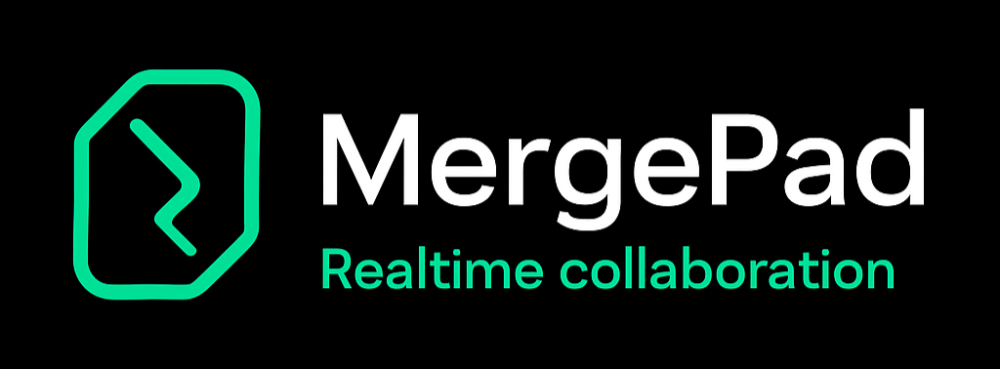

# 🚀 MergePad – Real-Time Collaborative Code Editor




**MergePad** is a real-time collaborative code editor that enables multiple users to write and edit code simultaneously. Built with **React**, **Node.js**, **Express**, and **Socket.IO**, it offers seamless synchronization and an intuitive user experience.

---

## 🧠 Features

- 🔗 **Real-Time Collaboration**: Multiple users can edit the same code simultaneously with instant updates.
- 🧑‍🤝‍🧑 **Room-Based Sessions**: Create or join rooms to collaborate with others.
- 📝 **Code Synchronization**: Ensures all participants see the latest code changes in real-time.
- 💬 **User Identification**: Displays usernames of all connected clients.
- 📤 **Code Sharing**: Easily share your code with others via room links.

---

## 🛠️ Tech Stack

- **Frontend**: React, HTML, CSS
- **Backend**: Node.js, Express
- **Real-Time Communication**: Socket.IO
- **Code Editor**: Monaco Editor (or your chosen code editor)
- **Deployment**: [Specify your deployment platform, e.g., Vercel, Heroku]

---

## 📸 Screenshots


---

## 🚀 Getting Started

### Prerequisites

- **Node.js** (v14 or later)
- **npm** or **yarn**

### Installation

1. **Clone the repository:**

   ```bash
   git clone https://github.com/SAMEER-40/Editor.git
   cd Editor
   ```

2. **Install dependencies:**

   ```bash
   npm install
   # or
   yarn install
   ```

3. **Set up environment variables:**

   Create a `.env` file in the root directory and add the following:

   ```env
   REACT_APP_BACKEND_URL=http://localhost:5000
   ```

4. **Build the frontend:**

   ```bash
   npm run build
   # or
   yarn build
   ```

5. **Start the server:**

   ```bash
   node server.js
   ```

6. **Access the application:**

   Open your browser and navigate to `http://localhost:5000`.

---

## 📁 Project Structure

```
├── build/                  # Compiled frontend files
├── src/
│   ├── components/         # Reusable React components
│   ├── screens/            # React pages (Home, Editor)
│   ├── App.js              # Main React component
│   ├── index.js            # Entry point for React
│   ├── Action.js           # Action constants for Socket.IO
│   └── socket.js           # Socket.IO client configuration
├── server.js               # Express server with Socket.IO
├── package.json            # Project metadata and scripts
└── README.md               # Project documentation
```

---

## 🤝 Contributing

Contributions are welcome! Please follow these steps:

1. **Fork the repository**
2. **Create a new branch:**

   ```bash
   git checkout -b feature/YourFeature
   ```

3. **Commit your changes:**

   ```bash
   git commit -m 'Add YourFeature'
   ```

4. **Push to the branch:**

   ```bash
   git push origin feature/YourFeature
   ```

5. **Open a pull request**

Please ensure your code adheres to the project's coding standards and includes appropriate tests.

---

## 📄 License

This project is licensed under the [MIT License](LICENSE).

---

## 📬 Contact

- **Author**: [Sameer](https://github.com/SAMEER-40)
- **Email**: [your-email@example.com](mailto:your-email@example.com)
- **LinkedIn**: [Your LinkedIn Profile](https://www.linkedin.com/in/your-profile)

---

## 🙏 Acknowledgements

- [Socket.IO](https://socket.io/)
- [React](https://reactjs.org/)
- [Express](https://expressjs.com/)
- [Monaco Editor](https://microsoft.github.io/monaco-editor/)

---

Feel free to customize this `README.md` to better fit your project's specifics. Adding visuals like screenshots or GIFs can further enhance its appeal. For more inspiration, consider exploring [othneildrew/Best-README-Template](https://github.com/othneildrew/Best-README-Template) or [shields.io](https://shields.io) for badges.

If you need assistance with deployment instructions or additional features, feel free to ask! 